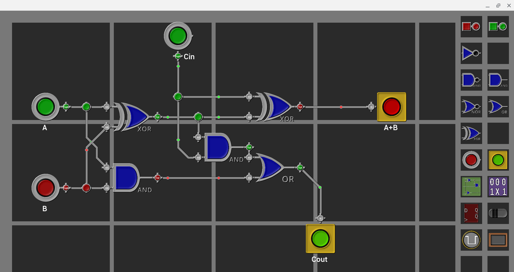
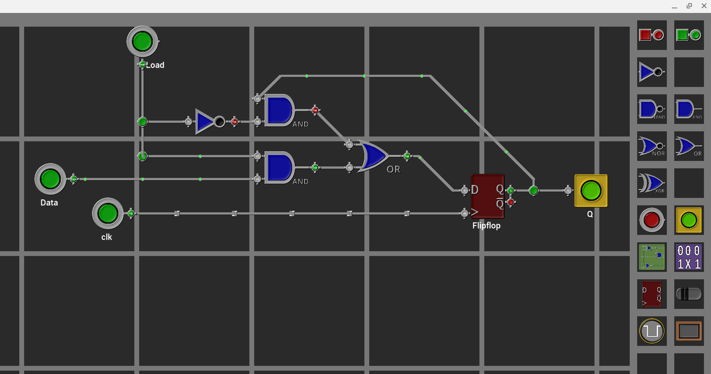
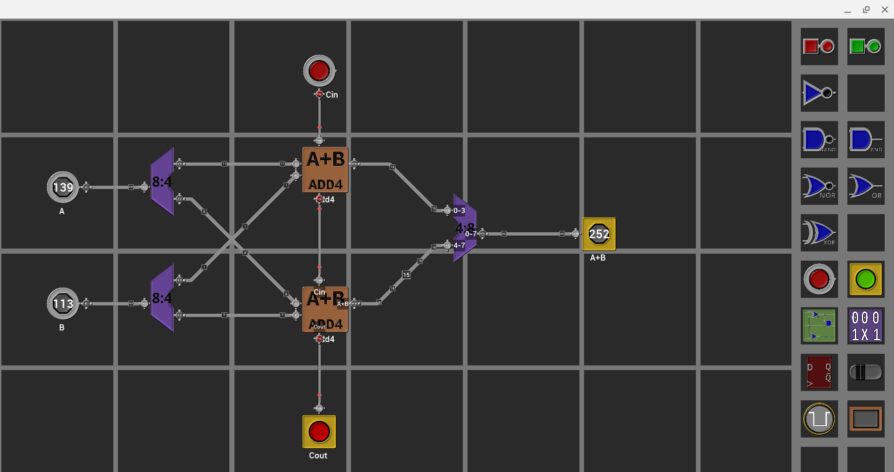
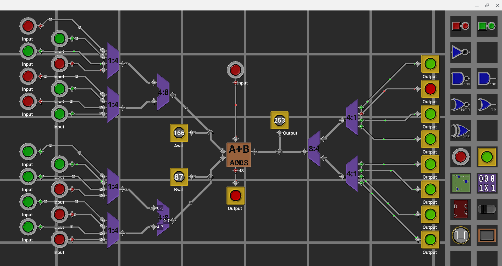

gridcad

this is a very-much-WIP project to make a gui based graphical digital
circuit designer

right now it's linux only and very far from usable but it's a fun project
to code on.

screenshots
-----------

credits / references
--------------------
I first got introduced to GUI based circuit design in college (Eindhoven
University of Technology) where the local digital design department
had created a tool called IDaSS (Integrated Design and Simulation System)
(https://www.sciencedirect.com/science/article/abs/pii/0165607490902488)
which allowed simultaneous design/simulation. While the big blocks 
were placed graphically - the detailed logic was coded in a LISP dialect.

Recently I saw a set of youtube videos on the subject of digital design
that showed a much more fancy looking way of doing the principles of IDaSS.
Go check out the channel from Sebastian Lague:
https://www.youtube.com/watch?v=HGkuRp5HfH8
He even has code on github as well, unfortunately it seems to be 
written for a game engine -- not my kettle of fish

Another reference is the Steam game called "Turing Complete"
which is a hoot to play and shared also some of the same GUI
design ideas.

