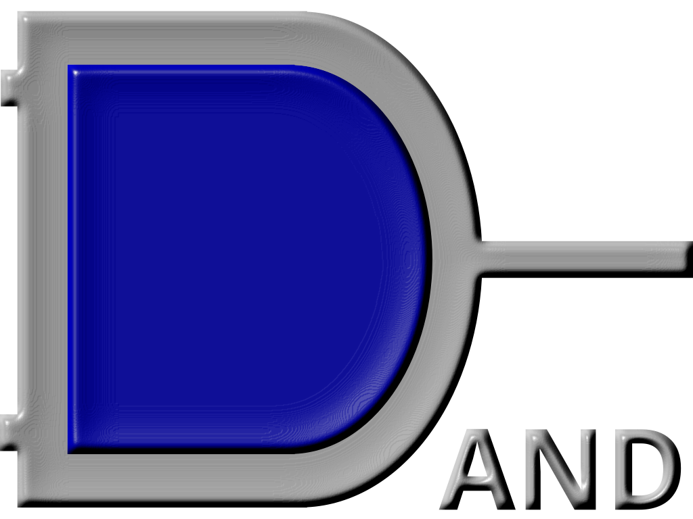
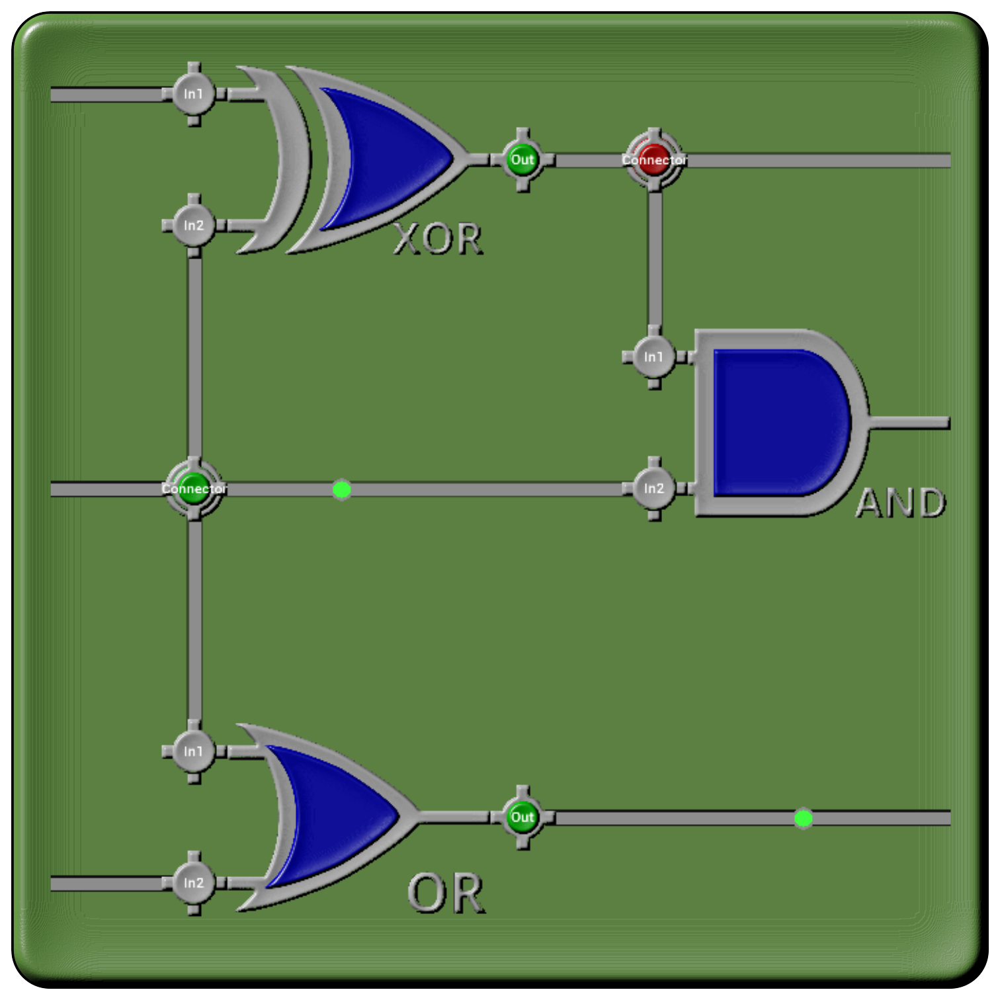
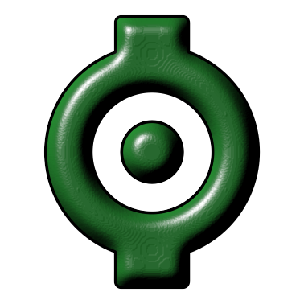
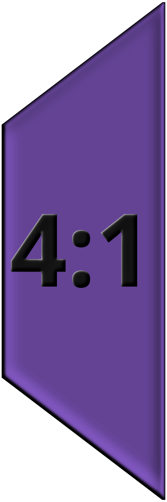
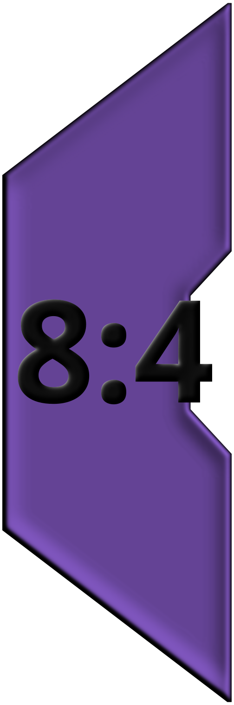

Built in elements
-----------------

One
===

This element has a variable width output, and puts the value of "true" or "all ones" one the bus.

Zero
====

This element has a variable width output, and puts the value of "false" or "all zeros" one the bus.

Not
===

This element has a single bit input and output, and will invert the input signal to the output.

Buffer
======

This element has a single bit data input, a single bit enable input and will either output the input bit (when enable is '1') or a 'Z' tristate value,
when enable is '0'. Note that there should be at most 1 non-Z buffer driving a bus at any point in time.

And
===

This element has two bit inputs and a single bit output, and will output the logical AND of the two inputs.

Or
===

This element has two bit inputs and a single bit output, and will output the logical OR of the two inputs.  

XOR
===

This element has two bit inputs and a single bit output, and will output the logical XOR of the two inputs.

Nand
===

This element has two bit inputs and a single bit output, and will output the logical NAND of the two inputs.    

Nor
===

This element has two bit inputs and a single bit output, and will output the logical NOR of the two inputs. 

Input
=====

This element has a single bit or multi-bit output and represents an external input to the design. During simulation,
one can enter a value into this element. During verilog synthesis of the top level of the design, these inputs
represent input IOs of the FPGA. For nested design elements, the Input elements inside the nested design will
form the input ports of the top level element, and the location of the port will roughly match the location
of the Input element in the nested design.

Output
======

This element has a single bit or multi-bit input and represents an external output from the design. During simulation,
the value of this element will be displayed. During verilog synthesis of the top level of the design, these outputs
represent output IOs of the FPGA. For nested design elements, the Output elements inside the nested design will
form the output ports of the top level element, and the location of the port will roughly match the location
of the Output element in the nested design.

Nested scene
============

A nested scene provides a whole new canvas for you to design in, and the inputs and outputs in that design
will form the input and output ports of the Nested scene element.

Truth table
===========

This element has a configurable number of input and output (single bit) ports, and will let you
describe a full truth table. Truth tables support "don't care" inputs and outputs.

D-FlipFlop
==========

A D-FlipFlop provides a (single bit) memory element. Every rising clock, the value of the input (D) port
will be stored in the flip flop. The output (Q) port will be the value of the flip flop. 

DE-FlipFLop
===========

A DE-FlipFlop provides a (single bit) memory element. Every rising clock, when the Enable input has the value '1', the value of the input (D) port
will be stored in the flip flop, while if the Enable input has the value '0', the existing value will be retained. The output (Q) port will be the value of the flip flop.

Clock
=====

The clock element provides a single bit clock signal, used for the various memory-type elements.
Note that clock signals are global in that all clocks will run at the same rate and phase.
To easily wire up all clock pins in a scene use the  autoclock menu option.

Display
=======

The display element will show the value of the input port, but is otherwise a passive element
and will not change behavior of the design. The Display element is a virtual element in that it will not synthesize into 
any verilog output.

Bus width converters/splitters/joiners
--------------------------------------

Memory
------

Memory
======

The Memory element is a single port, SRAM style memory. The data output represents the content of memory at the given address (at the previous clock cycle), and the data input represents the content to be stored at the given address. The WriteEnable port decides if a write operation should be performed.

